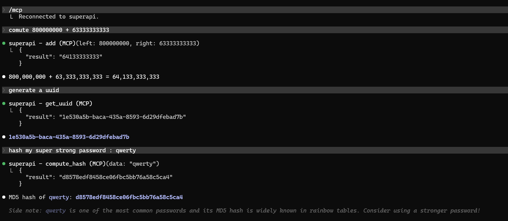

# first-mcp

A minimal MCP server backed by a local FastAPI



## What it does

Exposes three tools to Claude via MCP:

- `get_uuid` — generates a UUID v4
- `compute_hash` — MD5-hashes a string
- `add` — adds two integers

The MCP server calls a local FastAPI instance running on `localhost:8000`.

## Setup

```sh
# Start the API
make api

# Register the MCP server with Claude
make install
```
